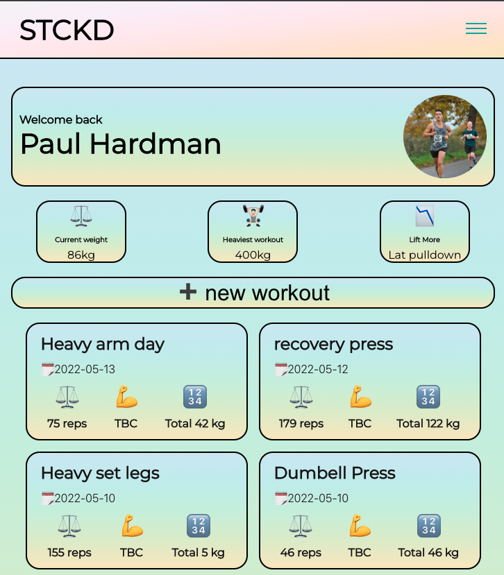
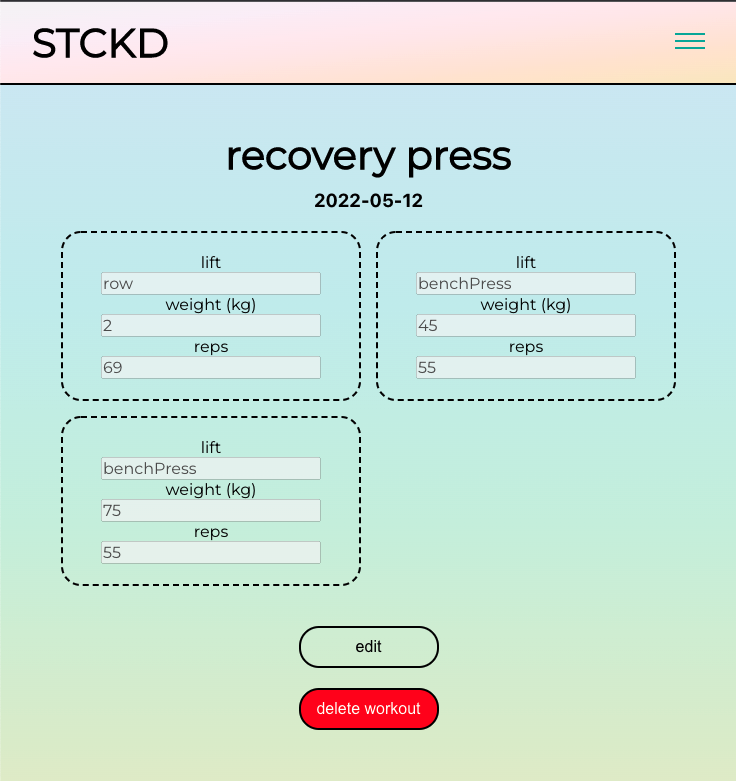

## Stacked: workout tracker

Stacked (STCKD) is A CRUD app developed during week 12 of the nology bootcamp. The front end is build using React and it allows the user to view, post, update and delete their workouts. The back end is build with Java Spring, the API and database supporting the app are hosted with Google Cloud Platform (GCP). 

## Tech Stack

## 
## 
